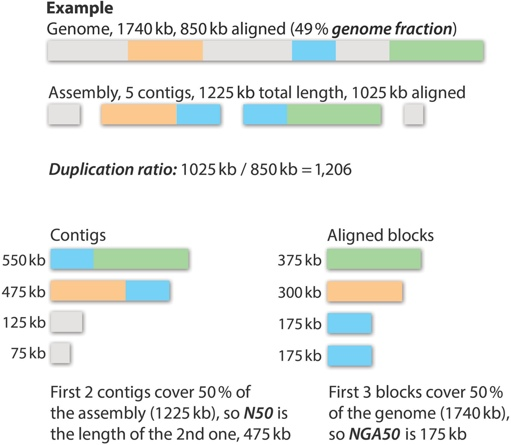

QUAST evaluates genome assemblies.  
It works either with or without a given reference genome. The tool accepts multiple assemblies, thus it is suitable for comparison.

Usage:
    ./quast.py test_data/contigs_1.fasta \
               test_data/contigs_2.fasta \
               -R test_data/reference.fasta.gz \
               -O test_data/operons.txt \
               -G test_data/genes.txt \
               -o output_directory  

Output:
     report.txt     summary table  
     plots.pdf      plots for some statistics  
     report.html    everything in HTML  
     alignment.svg  visualized alignement of contigs to reference

Also:  
     report.tsv     tab-separated summary, for parsing, or for spreadsheets (Google Docs, Excel, etc)  
     report.tex     Latex version

 

**Metrics based only on contigs:**  

* Number of large contigs (i.e., longer than 500 bp) and total length of them.  
* Length of the largest contig.  
* N50 (length of a contig, such that all the contigs ofat least the same length together cover at least 50% of the assembly).  
* Number of predicted genes, discovered either by GeneMark.hmm (for prokaryotes), GlimmerHMM (for eukaryotes) or MetaGeneMark (for metagenomes).  

**When a reference is given:**  

* Numbers of misassemblies of different kinds (inversions, relocations, translocations or local).  
* Number and total length of unaligned contigs.  
* Numbers of mismatches and indels, over the assembly and per 100 kb.  
* Genome fraction %, assembled part of the reference.  
* Duplication ratio, the total number of aligned bases in the assembly divided by the total number of those in the reference. If the assembly contains many contigs that cover the same regions, its duplication ratio will significantly exceed 1. This occurs due to multiple reasons, including overestimating repeat multiplicities and overlaps between contigs.  
* Number of genes in the assembly, completely or partially covered, based on a user-provided list of gene positions in the reference.  
* NGA50, a reference-aware version of N50 metric. It is calculated using aligned blocks instead of contigs. Such blocks are obtained after removing unaligned regions, and then splitting contigs at misassembly breakpoints. Thus, NGA50 is the length of a block, such that all the blocks of at least the same length together cover at least 50% of the reference.  

 
For more features and explanations, see the [manual](http://quast.bioinf.spbau.ru/manual).

You can also check out the web interface: [http://quast.bioinf.spbau.ru](http://quast.bioinf.spbau.ru)